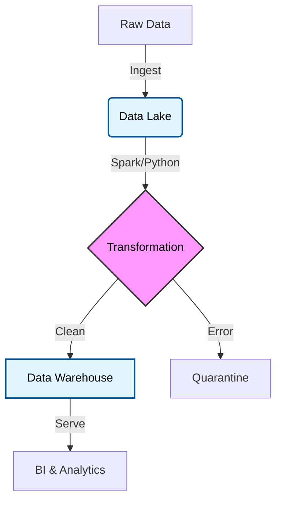

### About Me 👋

```python
class SeniorDataArchitect:
    def __init__(self):
        self.name = "Sai Gowtham Badvity"
        self.experience = "14.5 Years"
        self.current_focus = ["Data Engineering", "System Design", "Mentoring"]
        self.mission = "Bridging the gap between Academic Theory and Industry Reality."

    def get_daily_routine(self):
        return {
            "morning": "Architecting Scalable Data Pipelines",
            "evening": "Mentoring the next generation of Engineers",
            "always": "Refactoring bad code & learning best practices"
        }
```


### My Architecture Philosophy 🏛️



### My GitHub Account Stats ⚡

